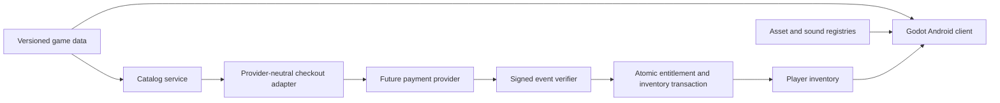

# Shop, inventory, and entitlement architecture

Status: architecture and prototype metadata only. No payment provider, checkout, webhook, account system, database, public shop, or production price is implemented or enabled by this change.

## Objective

The future shop must grant approved content to the authenticated player immediately after the server verifies a successful payment event. A client redirect, locally cached response, or device receipt is never sufficient evidence of ownership.

The first milestone defines the engine-independent data boundary for:

- item definitions and metadata;
- logical shop offers and pending prices;
- player-owned inventory and loadout state;
- server-issued purchase entitlements;
- visual, model, animation, and audio references;
- 10 prototype weapon concepts and 20 prototype gear concepts.

## Source-of-truth boundaries

| Data | Source of truth | Client authority |
| --- | --- | --- |
| Item name, category, stats, rarity, description | `packages/game-data/data/item-catalog.v1.json` | Read-only |
| Placeholder visual/model/animation references | Item catalog, then `assets/registry.json` after an asset exists | Read-only |
| Logical audio cues | `packages/game-data/data/audio-cues.v1.json`, then `assets/sound-registry.json` after audio exists | Read-only |
| Logical offer and entitlement IDs | `packages/game-data/data/shop-catalog.v1.json` | Read-only |
| Active price and provider product mapping | Future backend catalog service | None |
| Ownership, unlock, purchase, quantity, equipped slot | Future authenticated inventory service | Request changes only |
| Payment verification and entitlement state | Future commerce service | None |
| Local offline cache | Android client | Cache only; cannot grant ownership |

Ownership is intentionally not stored on static item definitions. It is player-specific, revisioned state returned by the authenticated backend.



## Static item model

Each item has a stable ID, SKU, category, description, purpose, rarity, required level, prototype status, logical offer ID, visual identity, sound identity, placeholder asset references, audio cue references, and category-specific stats.

Weapons additionally define damage, fire rate, range, capacity, handling, ammunition, reload behavior, reload duration, and fire/reload/equip cues. Gear defines normalized protection, utility, mobility, and capacity ratings plus explicit stat effects.

Example, shortened from the shared catalog:

```json
{
  "id": "weapon.raven12",
  "name": "Raven-12 Tactical Shotgun",
  "category": "weapon",
  "rarity": "rare",
  "shopOfferId": "offer.weapon.raven12.v1",
  "stats": {
    "damage": 92,
    "fireRateRpm": 70,
    "rangeMeters": 22,
    "magazineCapacity": 6,
    "handling": 44
  },
  "audio": {
    "fire": "audio.weapon.raven12.fire",
    "reload": "audio.weapon.raven12.reload",
    "equip": "audio.weapon.raven12.equip"
  },
  "status": "prototype",
  "canonical": false
}
```

The numbers establish a schema and relative concept identity. They are not approved balance values.

## Shop catalog and pricing

The repository catalog owns stable logical offer IDs. It does not contain payment-provider product IDs, price IDs, secret keys, or trusted live prices.

All first-milestone offers are:

```json
{
  "status": "not_for_sale",
  "price": {
    "status": "pending_review",
    "currency": "USD",
    "unitAmountMinor": null
  }
}
```

A future backend response may expose an active, localized display price after joining a logical offer to an approved provider mapping. Checkout creation must resolve the price again on the server. A client-submitted amount, currency, product ID, discount, or entitlement ID is ignored or rejected.

## Player inventory and loadout

The shared TypeScript contract defines a revisioned inventory:

```json
{
  "schemaVersion": 1,
  "revision": 12,
  "items": [
    {
      "itemId": "weapon.raven12",
      "entitlementId": "entitlement_opaque_id",
      "ownershipStatus": "owned",
      "unlockStatus": "unlocked",
      "purchaseState": "purchased",
      "quantity": 1,
      "equippedSlot": "primary",
      "acquiredAt": "2026-07-18T00:00:00.000Z"
    }
  ]
}
```

The server owns the revision and all ownership fields. Equip requests may select only an owned, active, compatible item. Durable purchases use quantity `1`; consumables require a later quantity and consumption contract.

## Proposed REST resources

The player-facing API is REST/JSON under `/api/v1` and uses authenticated, player-scoped resources. These routes are design targets, not implemented endpoints.

```http
GET  /api/v1/shop/catalog
POST /api/v1/shop/checkout-sessions
GET  /api/v1/shop/purchases/{purchaseId}
GET  /api/v1/me/inventory
GET  /api/v1/me/entitlements
PUT  /api/v1/me/loadout
```

`GET /api/v1/shop/catalog` returns only active offers, localized display prices, item IDs, and eligibility. It supports ETags and a version so the Android client can cache it safely.

`POST /api/v1/shop/checkout-sessions` accepts only a logical `offerId`, locale, return target allowlist value, and an `Idempotency-Key`. The backend resolves the authenticated player, active offer, authoritative price, purchase eligibility, and provider mapping.

```json
{
  "offerId": "offer.weapon.raven12.v1",
  "locale": "en-US",
  "returnTarget": "android"
}
```

The response contains an opaque purchase ID, provider-hosted checkout URL or platform handoff token, and expiration. It does not grant an entitlement.

`GET /api/v1/shop/purchases/{purchaseId}` returns `pending`, `verified`, `granted`, `failed`, `refunded`, or `revoked`. The purchase is scoped to the authenticated player.

`PUT /api/v1/me/loadout` requires the current inventory revision or ETag and is idempotent. It cannot change ownership or grant an item.

## Verified purchase flow

1. The authenticated client selects an available logical offer.
2. The backend validates availability, eligibility, ownership, and the authoritative price.
3. A provider-neutral adapter creates a checkout session using server-held provider configuration.
4. The client completes the provider-hosted flow.
5. The provider sends a signed event to a non-client commerce endpoint.
6. The backend verifies the signature, event type, amount, currency, offer mapping, payment state, and account binding.
7. A single database transaction records the deduplicated provider event, activates the entitlement, inserts or updates the inventory item, and increments the inventory revision.
8. Only after that transaction commits does the purchase become `granted` and the confirmation audio/UI become valid.
9. The Android client refreshes purchase status and inventory, then allows equip.

The target service objective is a p95 entitlement grant within three seconds after the backend receives a valid payment event. Provider delivery time is external and must be represented as a pending state rather than a false failure or local grant.

## Idempotency, retries, and recovery

- Checkout creation requires an `Idempotency-Key` scoped to player and offer.
- Provider event IDs are unique and processed once.
- Repeated valid events return the existing purchase result without duplicating inventory.
- Entitlement creation and inventory mutation occur in one transaction.
- A retry worker may resume verified-but-ungranted events safely.
- A client may poll purchase status with bounded exponential backoff.
- Refund and dispute events transition the entitlement and inventory according to a reviewed revocation policy.
- No raw provider payload, secret, access token, email, or payment detail enters game data or client logs.

## Error contract

Errors use a stable envelope with an opaque request ID:

```json
{
  "error": "offer_unavailable",
  "message": "This item is not currently available.",
  "requestId": "opaque-correlation-id"
}
```

Expected codes include `unauthorized`, `offer_unavailable`, `already_owned`, `eligibility_failed`, `price_changed`, `purchase_pending`, `payment_not_verified`, `conflict`, `rate_limited`, and `service_unavailable`. Internal provider errors, hostnames, paths, stack traces, and configuration never reach the client.

## Data-driven audio

The Android client resolves logical cue IDs through the audio cue catalog. Major interaction cues are defined for:

- main-menu music;
- shop background music;
- shop item selection;
- verified purchase confirmation;
- inventory navigation;
- weapon fire, reload, equip, and showcase;
- gear equip and showcase.

Every current cue is a placeholder with `assetRegistryId: null`. The client must fail silently when a cue has no approved asset. A successful purchase sound plays only after the backend reports `granted`, never after the provider redirect alone.

## Placeholder asset pipeline

1. Item metadata creates stable placeholder IDs for preview image, mobile-ready model, and animation set.
2. Only milestone-critical assets are commissioned or generated.
3. Production candidates record provider, model, prompt/brief, settings, ownership, checksum, and review status.
4. Existing binaries enter `assets/registry.json` or `assets/sound-registry.json`; placeholder item references then bind to the approved registry ID.
5. Mobile models use three LOD tiers, simple collision, compressed textures, and a device-tested memory/draw-call budget.
6. An item remains prototype/non-canonical until content, gameplay, legal, and commercial review are complete.

No preview images, models, animations, or audio files are generated in this architecture milestone.

## Android consumption

Godot should import the three versioned JSON documents through the existing shared-data bridge. A thin adapter maps stable IDs to Godot resources and validates supported schema versions at boot.

The client may cache catalog and inventory responses for offline presentation. Offline state may display previously verified ownership, but purchasing, restoring, entitlement changes, and first-time equip of newly purchased content require server reconciliation. Local save files store stable item IDs and equipped slots, not prices or provider identifiers.

## Implementation gates before Stripe

Stripe or another payment provider must not be implemented until all of the following are reviewed:

- authentication and account recovery;
- inventory and entitlement database constraints;
- active catalog and pricing ownership;
- checkout, webhook signature, and event-deduplication contracts;
- tax, refund, dispute, regional availability, and parental-consent policy;
- privacy, terms, contact, retention, deletion, and support processes;
- Android purchase-flow policy and Google Play billing compliance review;
- synthetic contract tests for duplicate events, delayed events, retries, refunds, and cross-player isolation;
- observability that excludes personal, payment, and secret data.

This design keeps a future Stripe adapter replaceable. Provider-specific IDs and SDK calls belong behind the server commerce adapter, never in the Android gameplay code or canonical item definitions.
